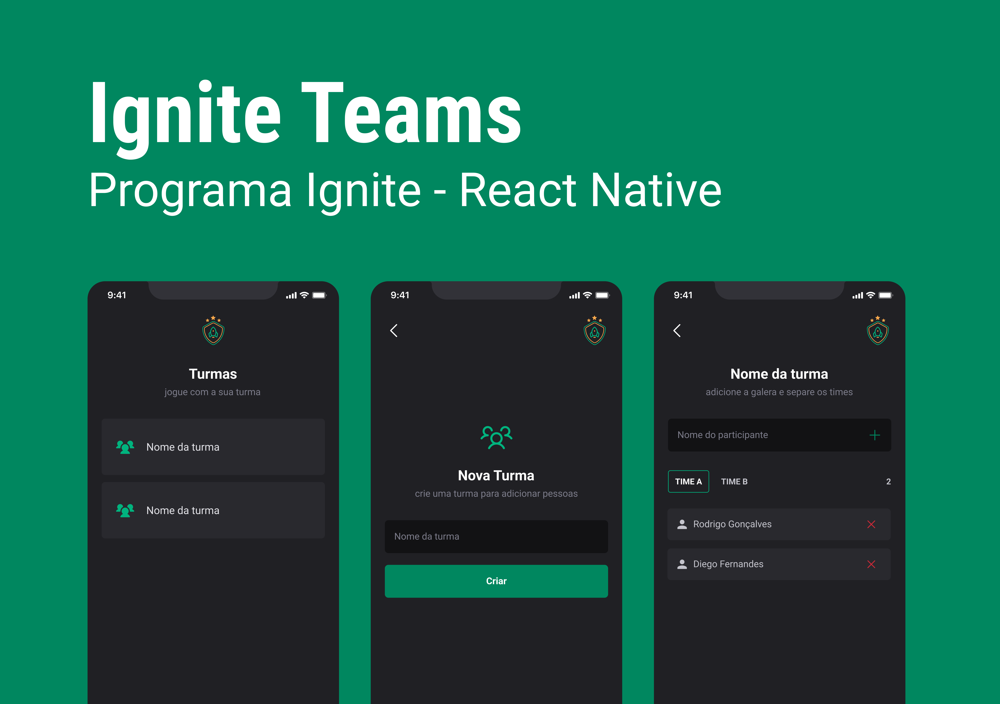

# Ignite Teams React Native



## Descrição

Organize as pessoas por equipe.


## Para rodar o projeto na sua máquina

Clone o projeto:

```bash
git clone https://github.com/Alberinando/igniteTeams.git
cd igniteTeams
```

Instale as dependêcias:

```bash
  yarn install
```

Para iniciar o **_Metro_**, execute o seguinte comando a partir da raiz do seu projeto React Native:

```bash
# using npm
npm start

# OR using Yarn
yarn start
```

## Inicie o Aplicativo

Deixe o Metro Bundler rodar em seu próprio terminal. Abra um novo terminal na raiz do seu projeto React Native. Execute o seguinte comando para iniciar seu aplicativo Android ou iOS:

### Para Android

```bash
  # Usando npm
npm run android

# Ou usando o Yarn
yarn android
```

### Para iOS

```bash
# Usando npm
npm run ios

# Ou usando Yarn
yarn ios
```

Se tudo estiver configurado corretamente, você deve ver o aplicativo rodando no seu Emulador Android ou Simulador iOS em breve, desde que você tenha configurado seu emulador/simulador corretamente.

Esta é uma maneira de rodar seu aplicativo — você também pode rodá-lo diretamente no Android Studio e no Xcode, respectivamente.